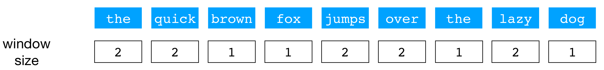
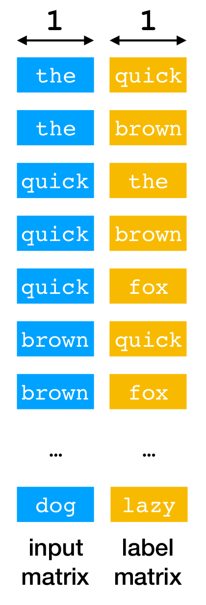
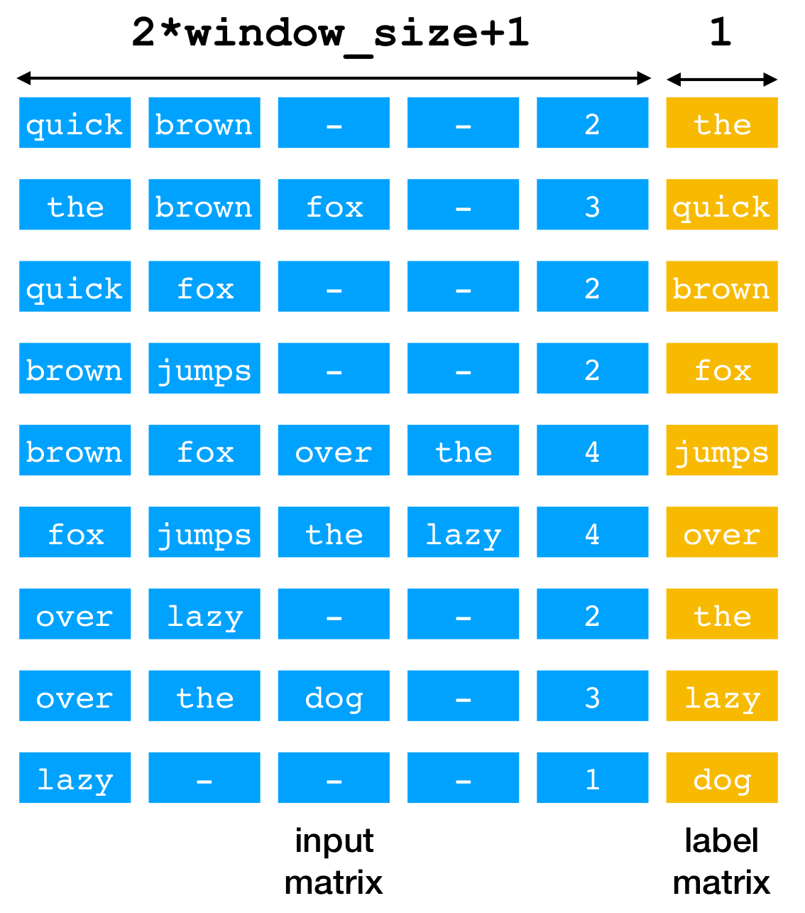
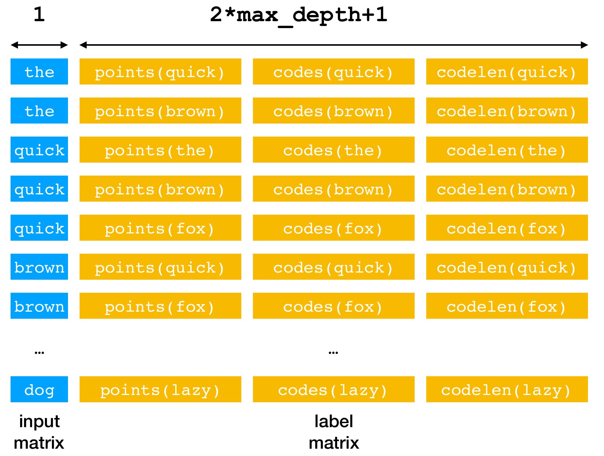
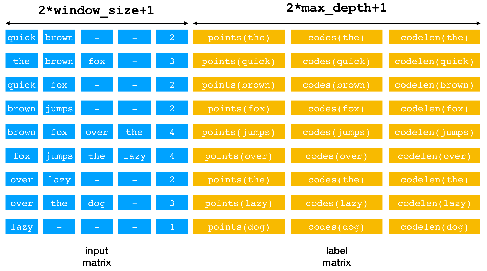

# Word2Vec: Learning distributed word representation from unlabeled text.

Word2Vec is a classic model for learning distributed word representation from large unlabeled dataset. There have been many implementations out there since its introduction (e.g. the original C implementation, and the gensim implementation). This is an attempt to reimplement word2vec in TensorFlow using the `tf.data.Dataset` APIs, a recommended way to streamline data preprocessing for TensorFlow models. 

### Usage
1. Clone the repository.
```
git git@github.com:chao-ji/tf-word2vec.git 
```
2. Prepare your data.
Your data should be a number of text files where each line contains a sentence, and words are delimited by space.

3. Parameter settings.
This implementation allows you to train the model under *skip gram* or *continuous bag-of-words* architectures (`--arch`), and perform training using *negative sampling* or *hierarchical softmax.* (`--algm`). 
 
4. Run.
Example:
```
  python run_training.py \
    --filenames=/PATH/TO/FILE/file1.txt,/PATH/TO/FILE/file2.txt
    --out_dir=/PATH/TO/OUT_DIR/
    --epochs=5
    --batch_size=64
    --window_size=5
```
The vocabulary words and word embeddings will be saved to `vocab.txt` and `embed.npy` (can be loaded using `np.load`).

### Sample results

The model was trained on the IMDB movie review dataset using the following parameters:

```
--arch=skip_gram --algm=negative_sampling --batch_size=256 --max_vocab_size=0 --min_count=10 --sample=1e-3 --window_size=10 --embed_size=300 --negatives=5 --power=0.75 --alpha=0.025 --min_alpha=0.0001 --epochs=5
```

Below are a sample list of queries with their most similar words.
```
query: actor
[('actors', 0.5314413),
 ('actress', 0.52641004),
 ('performer', 0.43144277),
 ('role', 0.40702546),
 ('comedian', 0.3910208),
 ('performance', 0.37695402),
 ('versatile', 0.35130078),
 ('actresses', 0.32896513),
 ('cast', 0.3219274),
 ('performers', 0.31659046)]
```

```
query: .
[('!', 0.6234603),
 ('?', 0.39236775),
 ('and', 0.36783764),
 (',', 0.3090561),
 ('but', 0.28012913),
 ('which', 0.23897173),
 (';', 0.22881404),
 ('cornerstone', 0.20761433),
 ('although', 0.20554386),
 ('...', 0.19846405)]

```

```
query: ask
[('asked', 0.54287535),
 ('asking', 0.5349437),
 ('asks', 0.5262491),
 ('question', 0.4397335),
 ('answer', 0.3868001),
 ('questions', 0.37007764),
 ('begs', 0.35407144),
 ('wonder', 0.3537388),
 ('answers', 0.3410588),
 ('wondering', 0.32832426)]
```

```
query: you
[('yourself', 0.51918006),
 ('u', 0.48620683),
 ('your', 0.47644556),
 ("'ll", 0.38544628),
 ('ya', 0.35932386),
 ('we', 0.35398778),
 ('i', 0.34099358),
 ('unless', 0.3306447),
 ('if', 0.3237356),
 ("'re", 0.32068467)]
```

```
query: amazing
[('incredible', 0.6467944),
 ('fantastic', 0.5760295),
 ('excellent', 0.56906724),
 ('awesome', 0.5625062),
 ('wonderful', 0.52154255),
 ('extraordinary', 0.519134),
 ('remarkable', 0.50572175),
 ('outstanding', 0.5042475),
 ('superb', 0.5008434),
 ('brilliant', 0.47915617)]
```
### Building dataset pipeline

Here is a concrete example of converting a raw sentence into matrices holding the data to train Word2Vec model with either `skip_gram` or `cbow` architecture.

Suppose we have a sentence in the corpus: `the quick brown fox jumps over the lazy dog`, with the window sizes (max num of words to the left or right of target word) below the words. Assume that the sentence has already been subsampled and words mapped to indices.

We call each of the word in the sentence **target word**, and those words within the window centered at target word **context words**. For example, `quick` and `brown` are context words of target word `the`, and `the`, `brown`, `fox` are context words of target word `quick`.

<p align="center">
  
</p>

For `skip_gram`, the task is to predict context words given the target word. The index of each target word is simply replicated to match the number of its context words. This will be our **input matrix**.

<p align="center">
  
  <br>
  <b>Skip gram, negative sampling</b>
</p>

For `cbow`, the task is to predict target word given context words. Because each target word may have a variable number of context words, we pad the list of context words to the maximum possible size (`2*window_size`), and append the true size of context words.

<p align="center">
  
  <br>
  <b>Continuous bag of words, negative sampling</b>
</p>
  
If training algorithm is `negative_sampling`, we simply populate the **label matrix** with the indices of the words to be predicted: context words for `skip_gram` or target words for `cbow`.

If training algorithm is `hierarchical_softmax`, a Huffman tree is built for the collection of vocabulary words. Each vocabulary word is associated with exactly one leaf node, and the words to be predicted in the case of `negative_sampling` are replaced by a sequence of `codes` and `points` that are determined by the internal nodes along the root-to-leaf path. For example, `E`'s `codes` and `points` would be `3782`, `8435`, `590`, `7103` and `1`, `0`, `1`, `0`. We populate the **label matrix** with the padded `codes` and `points` (up to `max_depth`), along with the true length of `codes`/`points`.

<p align="center">
  
  <br>
  <b>Huffman tree</b>
</p>


<p align="center">
  
  <br>
  <b>Skip gram, hierarchical softmax</b>
</p>

<p align="center">
  
  <br>
  <b>Continuous bag of words, hierarchical softmax</b>
</p>

In summary, an **input matrix** and a **label matrix** is created from a raw input sentence that provides the input and label information for the prediction task.


### Reference
1. T Mikolov, K Chen, G Corrado, J Dean - Efficient Estimation of Word Representations in Vector Space, ICLR 2013
2. T Mikolov, I Sutskever, K Chen, GS Corrado, J Dean - Distributed Representations of Words and Phrases and their Compositionality, NIPS 2013
3. Original implementation by Mikolov, https://code.google.com/archive/p/word2vec/
4. Gensim implementation by Radim Řehůřek, https://radimrehurek.com/gensim/models/word2vec.html
5. IMDB Movie Review dataset, http://ai.stanford.edu/~amaas/data/sentiment/
